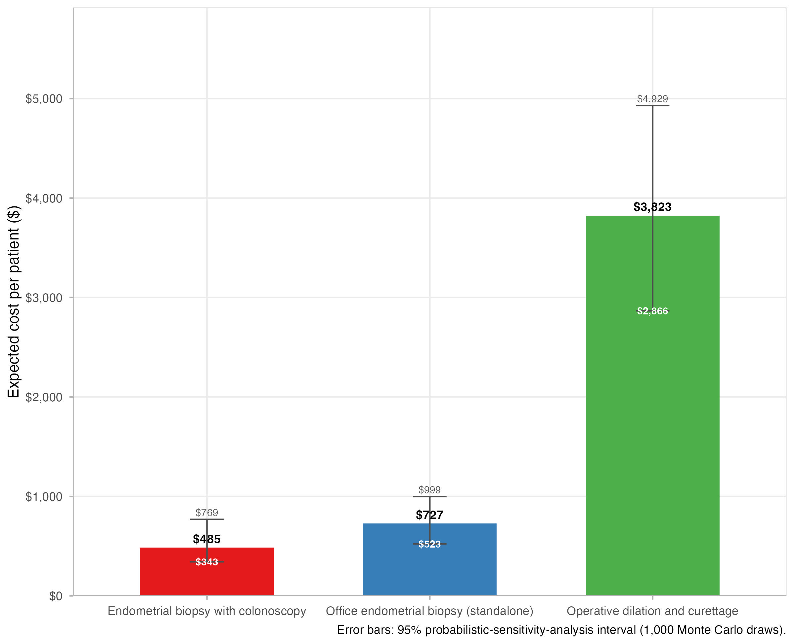
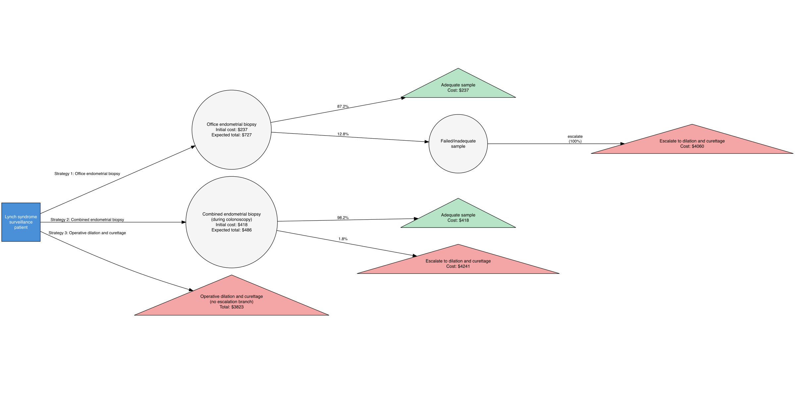
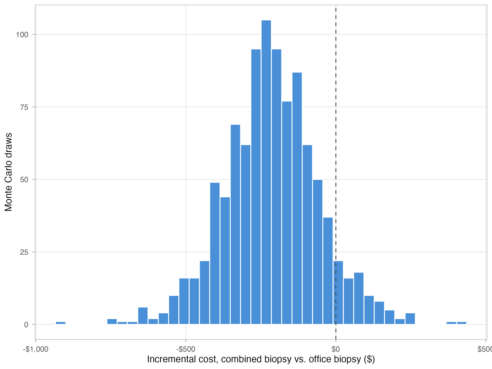
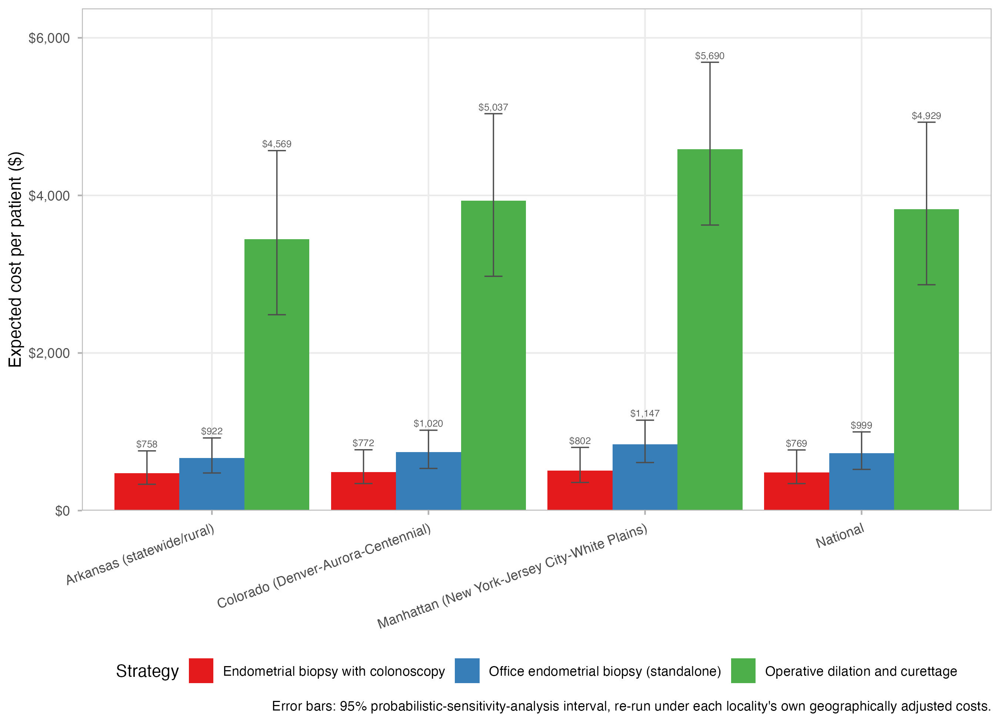

# emb_colonoscopy

[](https://github.com/mufflyt/emb_colonoscopy/actions/workflows/r-tests.yml)

A reproducible health-economic (cost-minimization) model comparing three ways to obtain an
endometrial tissue sample in patients with Lynch syndrome: standalone office endometrial biopsy
(EMB), operative dilation and curettage (D&C), and EMB performed during an already-scheduled
surveillance colonoscopy.

**This is an economic modeling study.** It does not use patient-level or institutional data. Every
parameter, assumption, and provisional placeholder is inspectable in
[`config/model_parameters.csv`](config/model_parameters.csv), and every analysis step is
reproducible by re-running the scripts in [`analysis/`](analysis/).

## The clinical problem, in plain language

Patients with Lynch syndrome face two overlapping cancer-surveillance burdens: frequent
colonoscopy for colorectal cancer, and periodic endometrial sampling because Lynch syndrome also
substantially raises endometrial cancer risk. Endometrial sampling can be done three ways:

1. **In the office**, as its own dedicated gynecology visit -- an endometrial biopsy (EMB)
   performed awake, sometimes uncomfortable, requiring its own trip and time off work.
2. **In the operating room**, as a dilation and curettage (D&C) -- more invasive, involving
   anesthesia, OR/facility resources, and a separate procedural encounter.
3. **Coordinated with colonoscopy** -- the patient is already sedated for surveillance colonoscopy,
   and the gynecologist adds an EMB during that same encounter, avoiding a separate visit and
   avoiding awake discomfort.

Two published MD Anderson studies (Huang et al. 2011; Nebgen et al. 2014) and a 2025 prospective
study (ONCE) have shown that combining colonoscopy and EMB is feasible, well-tolerated, and
preferred by patients -- but none of them costed it. This repository asks the next question: **what
does each strategy actually cost, and does coordinating biopsy with colonoscopy save money?**

## The incremental-cost principle

The central conceptual choice in this model: a Lynch patient undergoing surveillance colonoscopy is
assumed to be having that colonoscopy *regardless* of whether EMB is added to it. So the combined
strategy is never charged the colonoscopy's own professional fee, GI endoscopist fee, or baseline
sedation cost -- only the resources *incremental* to that already-planned procedure (extra
gynecologic time, biopsy supplies, pathology, extra room/anesthesia minutes, coordination overhead).
See [`docs/methods_notes.md`](docs/methods_notes.md) for the full reasoning and the decision-tree
structure (each strategy is an initial sampling attempt that either succeeds or escalates to
operative D&C).

## What the base case currently shows

> Among a modeled cohort of patients with Lynch syndrome already undergoing surveillance
> colonoscopy, performing endometrial biopsy during the same sedated encounter cost an estimated
> $506.11 per patient, compared with $749.18 for standalone office biopsy and $3,839.81 for
> operative dilation and curettage. Adding EMB to colonoscopy cost $243.06 less than performing EMB
> separately (32.4%). The combined strategy remains the least expensive strategy as long as the
> incremental colonoscopy-suite time stays below approximately 12.3 minutes.

This sentence is generated by `analysis/01_base_case.R` from live model output (see
`R/tables.R::build_summary_sentence()`) -- it is not hard-coded narrative; it is re-verified,
independently of that pipeline, by `analysis/12_independent_psa_verification.R` (see
"Independent verification" below). **Several inputs behind it are still provisional placeholders**
(see below); treat this as a demonstration of a working, transparent model, not a
publication-ready result.



*Figure 1. Base-case expected cost per patient, by strategy (`analysis/01_base_case.R`).*

## Provisional parameters -- read before citing any number from this repository

Every parameter in `config/model_parameters.csv` has a `provisional` column. As of this writing, 8
of 69 parameters are flagged `TRUE`: `patient_time_opportunity_cost_per_visit` (its $43 base value is
directly confirmed via three converging secondary sources, but the 2010 dollar-year used to
inflation-adjust it is inferred rather than primary-confirmed -- see "Perspective and extending this
model" below); the coordination-time half of `coordination_cost` (its wage half
is now a real BLS/O*NET figure); `office_to_dnc_escalation_fraction` (still flagged, but **superseded
2026-09-02** and no longer consumed by any cost or clinical-outcome function -- see "Office
repeat-attempt structure" below for the two real, sourced parameters that replaced it); two `reference_only` values
kept only as documented exclusions (`colonoscopy_anesthesia_episode_cost`, `dnc_recovery_room_cost`
-- both deliberately never summed into any strategy's cost); `office_emb_serious_infection_probability`
(base value 0, reflecting the total absence of incidence data rather than a claim of zero risk -- see
"Diagnostic-yield and clinical-outcome extension" below); and two `reference_only` adverse-event cost
anchors (`cost_uterine_perforation_gtn_model_2020`, `cost_hemorrhage_gtn_model_2020`) borrowed,
doubly-inherited and clearly flagged as such, from an unrelated gestational-trophoblastic-neoplasia
cost-effectiveness model, kept only as a documented starting point for a future real costing exercise.
`combined_requires_preop_office_visit` is now a confirmed clinical-practice decision (base case
includes a separate preop office visit for the combined arm), no longer flagged provisional. All six
of the D&C arm's own cost components --
professional fee,
pathology, facility fee, preop visit, and anesthesia -- are now real, sourced CMS values; so is the
office-EMB arm's E/M visit cost, `emb_disposable_supply_cost` is now a real CMS-itemized value, and
the once-conflicting CPT 58558 figure (`hysteroscopy_dc_professional_cost`, still unused in the base
case) has been resolved against a live CMS PUF query. `docs/data_sources.md` lists what each
remaining item still needs. **No provisional value should be quoted as a finding.**

## Diagnostic-yield and clinical-outcome extension (additive, not part of the base case)

`R/diagnostic_yield.R` adds two functions that test rather than assume this model's implicit
equivalent-effectiveness assumption, per the extension `docs/methods_notes.md` explicitly anticipated:
`compute_strategy_clinical_outcomes()` (the primary, repo-native question -- does office EMB's higher
inadequate-sampling probability leave a meaningful fraction of patients with a delayed cancer/precancer
diagnosis, and how much D&C-rescue-driven adverse-event exposure does each strategy imply? -- built
from parameters already resident in this repository plus newly added, real-cited D&C/hysteroscopy
adverse-event probabilities) and `compute_diagnostic_yield()` (a secondary, broader Pipelle-vs-D&C
detection-probability question, using published Sakna et al. 2023 sensitivities -- deliberately not
PSA-wired or built into a full diagnostic-accuracy decision tree, but as of 2026-09-02 actually run by
`analysis/13_diagnostic_yield.R` and reported as a manuscript Results paragraph, rather than sitting
unused). Neither changes
`compute_strategy_costs()`'s output; `run_probabilistic_sensitivity()` now carries the clinical-outcome
columns alongside cost columns for every draw, so cost and clinical-outcome findings share the same
Monte Carlo realizations. See `docs/data_sources.md` for the full parameter list and citations, and
`R/diagnostic_yield.R`'s file-level docblock for why the per-1,000 adverse-event and delayed-neoplasia
*counts* this module computes remain unmonetized clinical counts, not cost inputs -- a partial,
separate adverse-event *cost* was wired directly into `compute_dnc_strategy_cost()` instead (see
"Adverse-event costing" below), not into this module.

## Cost-consequence secondary analysis (added 2026-09-03): cost per additional case detected

A deliberately lighter alternative to a full cost-utility analysis (no QALYs, no stage-shift/survival
model -- see `docs/methods_notes.md` for why that's a much larger undertaking). `R/cost_effectiveness.R`
combines `compute_strategy_costs()`'s healthcare-sector cost with `compute_diagnostic_yield()`'s
detection probability into an incremental cost-effectiveness ratio (ICER): dollars per additional
expected true cancer/precancer case detected. Implements standard strict- and extended-dominance
rules generically (tested against synthetic cases, not just this repository's real data). Result:
ICER(office EMB vs combined EMB) ~ $20,843 per additional cancer case detected; ICER(D&C vs office
EMB) ~ $33,437. Deterministic point estimate, not PSA-integrated, same scope discipline as
`compute_diagnostic_yield()`. See `analysis/15_cost_effectiveness.R` /
`tables/cost_effectiveness.csv`. Now reported in the manuscript (2026-09-03), after tightening five
other Methods passages to make room within the journal's word limits; see `docs/methods_notes.md`'s
own section for the full account.

## Adverse-event costing (partial; wired into the D&C base-case cost)

`compute_dnc_strategy_cost()` (`R/strategy_costs.R`) includes an
`adverse_event_cost_partial_perforation_only` component: the expected cost of managing a uterine
perforation, restricted to the one management pathway (diagnostic laparoscopy) with a cost fully
traceable to current Medicare payment data, weighted by that pathway's observed probability in an
independent cohort study (Ben-Baruch et al. 1982, PMID 6212675). This is a deliberate lower bound,
not a complete adverse-event cost: perforations requiring laparotomy (a substantial minority of
cases) and severe hemorrhage are both excluded, because CPT 49000 (laparotomy) is classified by
Medicare as an inpatient-only procedure with no outpatient facility rate, and no source describing
hemorrhage's management pathway was located. See
[`docs/ae_cost_evidence_table.md`](docs/ae_cost_evidence_table.md) for the full accounting -- every
sourced and explicitly-unsourced term -- and `tests/testthat/test-strategy-costs.R` for the
mutation-tested regression test enforcing the exact formula.

## Office repeat-attempt structure (wired 2026-09-02)

`compute_office_emb_strategy_cost()` no longer models a failed office attempt as a single "escalation
fraction" (the old `office_to_dnc_escalation_fraction`, fixed at 100%, i.e. every failure assumed to
go straight to D&C). It now reproduces Yi et al. 2018's own decision-tree structure for a failed
Pipelle attempt: `office_repeat_attempt_fraction` (5%, an expert clinical estimate -- the complement
of Yi's own "P(moving to D&C if 1st attempted Pipelle failed) = 0.95") and
`office_repeat_attempt_success_probability` (75%, reconstructed 95% CI 70.73%-79.15%, from Kandil et
al. 2014's 1,120-patient insufficient-endometrial-sample cohort: 38% had a second sampling procedure
by 12-month follow-up, adequate in 75% of those -- **replaced 2026-09-02** from an original 25% figure
based on Adambekov et al. 2017's Table 1 n=8 subgroup, independently confirmed as the exact subgroup Yi
et al. 2018 cite for the identical purpose in their own methods text; see `config/model_parameters.csv`
for the reconstructed-CI methodology and its caveats). A repeat attempt costs the same $255.93 as the
initial visit, since it bills as an established-patient encounter.

**This lowered the office arm's base-case cost but raised its PSA mean.** The old
`office_to_dnc_escalation_fraction`'s `triangular(0.5, 1, 1)` distribution let PSA draws cut the
D&C-escalation probability by as much as half; the new structure's maximum possible reduction
(`repeat_attempt_fraction x repeat_attempt_success_probability`) is under 5% even at the upper 95% CI
bounds -- a narrower, better-disciplined range that no longer lets office EMB look artificially cheap
in some PSA draws. **It also eliminates the office arm's delayed-neoplasia estimate**: Yi et al.'s own
decision tree has no branch where a failed repeat attempt is left unresolved ("the physician will then
move to the D&C route"), so `office_unresolved_probability` is now exactly 0 in every draw, matching
the combined arm -- both arms' delayed-neoplasia risk is 0.00 under current evidence, which is a null
result, not proof either strategy's true risk is zero. See
[`docs/methods_notes.md`](docs/methods_notes.md)'s "Interpretation of delayed-neoplasia outcomes" for
the full account, and `tests/testthat/test-diagnostic-yield.R`/`test-strategy-costs.R` for the
mutation-tested regression tests.

## Decision-tree structure



*Figure 2. The three strategies as a one-step decision tree: an initial sampling attempt that
either succeeds or escalates to operative D&C, with the path-specific and expected total cost at
each terminal node (`analysis/10_decision_tree_figure.R`, built directly from live model output,
not hand-drawn).*

## Probabilistic sensitivity analysis



*Figure 3. Distribution of the incremental cost of combined EMB versus office EMB across 1,000
Monte Carlo draws (`analysis/03_probabilistic_sensitivity.R`). Combined EMB was the least
expensive strategy in 91.4% of draws; D&C was never the least expensive strategy in any draw.*

## Geographic sensitivity analysis

`R/geographic_sensitivity.R` re-prices the base-case strategies at four localities -- national,
Colorado, a low-cost locality (Arkansas), and a high-cost locality (Manhattan) -- using real CMS GPCI
values for professional fees and the real CMS OPPS wage index (with the actual CY2026 60% labor-related
share) for the D&C facility fee. No geographic multiplier is invented; every value traces to a
downloaded CMS file (`docs/data_sources.md` has the exact files and citations). Combined EMB remained
the least expensive strategy in all 4 of 4 localities tested (`Rscript analysis/09_geographic_sensitivity.R`),
with its advantage over office EMB widening from $195.62 (low-cost) to $333.44 (high-cost) per patient
-- i.e. the base-case conclusion is not an artifact of national-average pricing. Deliberately
deterministic, not part of the PSA (see `docs/methods_notes.md` for why).



*Figure 4. Expected cost per strategy at four Medicare payment localities
(`analysis/09_geographic_sensitivity.R`).*

## Repository structure

```text
emb_colonoscopy/
  R/              model functions: parameters, validation, inflation, strategy costs,
                   comparison, deterministic + probabilistic sensitivity, threshold
                   analysis, scenarios, geographic sensitivity, diagnostic yield,
                   plotting, tables
  analysis/        twelve numbered scripts: base case, deterministic sensitivity,
                   probabilistic sensitivity, threshold analysis, scenario analysis,
                   evidence layers, manuscript outputs, colonoscopy setting,
                   geographic sensitivity, decision-tree figure, manuscript table,
                   independent PSA verification
  config/          config/model_parameters.csv -- the single source of truth for every
                   model input
  data/            data/cpi_medical_care.csv (inflation index), plus real CMS GPCI and
                   PFS RVU data used by the geographic sensitivity analysis
  data-raw/        instructions for replacing the placeholder price-index value
                   (deliberately not wired to fetch data automatically)
  tests/           testthat unit and model-identity tests (Rscript tests/testthat.R)
  figures/         generated .jpeg/.png figures
  tables/          generated .csv tables and the model-generated summary sentence
  manuscript/      Green Journal (Obstetrics & Gynecology)-format submission files:
                   title_page.qmd, manuscript.qmd, cheers_checklist.qmd (Quarto,
                   render with `quarto render manuscript/<file>.qmd`)
  docs/            reuse mapping, data source provenance, methods notes, validation
                   notes, CHEERS 2022 audit, testing philosophy, appendix
```

## Quick start

```r
install.packages(c(
  "readr", "dplyr", "tibble", "tidyr", "purrr", "ggplot2", "scales",
  "forcats", "rlang", "testthat",
  # evidence layer + public-input acquisition
  "duckplyr", "httr2", "readxl", "stringr", "openssl"
))
```

```sh
cd emb_colonoscopy
Rscript tests/testthat.R                        # run the test suite
Rscript analysis/01_base_case.R                  # base-case comparison + budget impact + Figure 1
Rscript analysis/02_deterministic_sensitivity.R  # one-way sensitivity + tornado (Figure 2)
Rscript analysis/03_probabilistic_sensitivity.R  # Monte Carlo PSA + probability-cheapest (Figure 4)
Rscript analysis/04_threshold_analysis.R         # threshold analyses + sweep plots (Figure 3)
Rscript analysis/05_scenario_analysis.R          # Medicaid/commercial/historical scenarios (Figure 5)
Rscript analysis/00_get_public_inputs.R          # acquire MEPS files + a frozen 120-hospital HPT sample
Rscript analysis/06_evidence_layers.R            # CMS/HPT/MEPS public-data benchmarks
Rscript analysis/08_colonoscopy_setting.R        # national colonoscopy facility-setting/ASC analysis (2019-2024)
Rscript analysis/09_geographic_sensitivity.R     # 4-locality Medicare GPCI/wage-index re-pricing (Figure 6)
Rscript analysis/10_decision_tree_figure.R       # decision-tree model diagram (Figure 7)
Rscript analysis/07_manuscript_outputs.R         # consolidated Tables 1-9
Rscript analysis/11_manuscript_table10_summary.R # base-case + PSA clinical-outcome summary table
Rscript analysis/12_independent_psa_verification.R # re-derives PSA clinical-outcome claims without calling model code
```

Every script logs its inputs, major transformations, and exact output file paths via
`base::message()` as it runs.

## Threshold questions this model answers

Run via `analysis/04_threshold_analysis.R`, using root-finding (`stats::uniroot()`) on the full cost
model rather than a closed-form formula, so each threshold automatically accounts for second-order
effects (e.g. a higher D&C cost also raises the office and combined arms' expected cost through their
own escalation-to-D&C branches):

- How much additional colonoscopy-suite time can EMB require before the combined strategy stops
  being the cheapest?
- At what office-EMB failure probability does coordinated sampling become cost-saving?
- How expensive would D&C need to become before it is dominated by both alternatives? (Under current,
  partly-provisional D&C-arm parameters, the answer is: it already is, even before any facility fee
  -- see the caveat in `docs/methods_notes.md`.)
- How much coordination/staffing cost can be added to the combined strategy before it loses its
  advantage over standalone office EMB?

## Evidence layer: benchmarking parameters against public data

Beyond the literature-parameterized model, `R/cms_benchmarks.R`, `R/hpt_prices.R`,
and `R/meps_burden.R` pull cost benchmarks directly from public sources: the live
CMS Medicare physician-fee API (no setup required), hospital Price Transparency
machine-readable files (requires a manifest of real hospital URLs, never committed),
and MEPS patient/societal burden data (requires local public-use files, never
committed). An APCD claims-linkage layer and a CMS facility/OPPS layer were designed
and prototyped but deliberately dropped -- see
[`docs/evidence_layers.md`](docs/evidence_layers.md) for why, including real bugs the
review process caught (data-masking name collisions in three separate places, a
reversed inequality-join, a CMS API endpoint that silently returns an unfiltered
dataset rather than erroring on a bad filter field, and a real-vs-assumed CMS column
name mismatch that a synthetic test fixture shared the same wrong assumption with and
so never caught) -- every one of them found only by actually running the code against
real or realistic data, not by reading it.

`analysis/00_get_public_inputs.R` reproducibly acquires the public inputs the CMS/HPT/
MEPS layers need: it downloads and validates the real 2024 MEPS office-visit and Jobs
files, downloads the current CMS hospital list, and draws a fixed-seed (`20260828`),
stratified (4 Census regions x 3 ownership types x 10 hospitals) sample of 120
hospitals for the HPT layer. Resolving that sample's actual price-transparency file
locations requires fetching each hospital's own CMS-mandated `cms-hpt.txt` -- a
larger, hospital-by-hospital network operation with genuinely spotty real-world
coverage (verified against one hospital's live file; not run in bulk as part of this
integration) -- so that step is left for a deliberate, separate run rather than
folded into routine setup.

`R/colonoscopy_setting.R` adds a complementary national analysis, orthogonal to the
cost model: what fraction of U.S. Medicare colonoscopy-coded services occur in
facility settings (ASC or hospital outpatient) where a coordinated, sedated EMB would
be structurally feasible in the first place, with correct ASC-vs-professional
separation to avoid double-counting facility billing. Verified against real 2024 data
and all six claimed years (2019-2024); see
[`docs/evidence_layers.md`](docs/evidence_layers.md).

Every parameter also carries an `evidence_tier` (A = Lynch-specific direct data, B =
contemporary public cost data, C = general/adjacent literature, D = provisional
placeholder). `R/literature_replication.R` provides a harness for validating this
model's engine against a published study's own parameters -- honestly scoped: it
cross-checks the Ladabaum et al. 2011 cost anchor, and explicitly marks Yi et al.
2018 and Havrilesky et al. 2009 as `pending_parameter_extraction` rather than faking
a reproduction (see [`docs/validation_notes.md`](docs/validation_notes.md)).

## Perspective and extending this model

The base case is a **U.S. healthcare-sector perspective**: CMS-anchored professional fees, pathology,
facility, and anesthesia/sedation costs, supplemented by published resource-cost estimates for
services Medicare does not separately reimburse. The parameter table already carries patient-reported values
not used in the base case (`office_emb_pain_parous`, `combined_emb_pain`, etc.). Functions accept
explicit inputs rather than depending on the global environment, so adding a QALY-based
cost-effectiveness extension should not require restructuring the existing office/combined/D&C cost
functions -- see `docs/methods_notes.md`'s note on why the base case is cost-minimization rather than
cost-effectiveness, and what would need to change to make it one.

**Societal-perspective secondary analysis (added 2026-09-02).** `R/societal_costs.R` reintroduces the
patient time and travel-time opportunity costs the base case excludes, as a separate, deterministic
secondary analysis -- not a change to the base case itself. Each strategy's expected number of
dedicated patient encounters (office visits, repeat visits, D&C's own preoperative visit plus
procedure day) is valued at a single published opportunity cost per ambulatory visit (Ray et al.
2015, PMID 26295356, $43 in 2010 dollars, inflated using a new general CPI-U series --
`data/cpi_all_items.csv`, deliberately not the medical-care CPI used elsewhere). Result: this widens,
rather than narrows, combined biopsy's cost advantage over office biopsy ($243.06 healthcare-sector ->
$257.94 societal-total in the base case; $412.32 under the existing alternate scenario where combined
biopsy's preoperative visit is folded into the colonoscopy day). See `docs/methods_notes.md`'s own
section for the full methodology and `analysis/14_societal_perspective.R` /
`tables/societal_perspective.csv` for the reproducible output. Disclosed limitation: every encounter
is valued at the same per-visit rate, including D&C's OR/anesthesia-day encounter, which likely
understates D&C's true relative burden -- the colonoscopy time-and-motion literature originally
flagged here as future work (patient time, travel, need for a driver) remains a genuine next step for
a differentiated, procedure-day-specific estimate; see `docs/data_sources.md`'s "Next literature to
mine" item 7.

## Reproducibility

`run_probabilistic_sensitivity()` (`R/sensitivity_probabilistic.R`) now defaults to a fixed
`seed = 20260901` rather than drawing from R's ambient RNG state. Before this, every call produced
a different 1,000-draw sample, which is how this project ended up, twice, with a manuscript quoting
PSA statistics from one run and clinical-outcome statistics from a different run -- both correct
individually, inconsistent together (see CHANGELOG.md). With a fixed default seed,
`analysis/03_probabilistic_sensitivity.R` and `analysis/07_manuscript_outputs.R` -- which both call
`run_probabilistic_sensitivity()` independently, against the same `config/model_parameters.csv` and
the same `n_simulations = 1000` -- now produce byte-identical draws, so their downstream tables
(`tables/probabilistic_sensitivity_draws.csv` and `tables/manuscript_table5_psa_summary.csv`) can no
longer silently drift apart. The RNG state is saved before seeding and restored on exit, so calling
this function never affects unrelated random draws elsewhere in the same R session. Pass
`seed = NULL` to deliberately opt back into an unseeded, genuinely random run (e.g. to explore
draw-to-draw variability); any other integer reproduces a different but still-fixed sequence.

## Independent verification

Per this project's independent-confirmation rule (see `docs/testing_philosophy.md`), a finding
capable of changing the study's conclusions is not confirmed if the confirmation reuses the same
pipeline that produced it. `analysis/12_independent_psa_verification.R` re-derives every
clinical-outcome and joint cost/outcome claim in the manuscript's Results and Discussion sections
(the 91.4% probability combined EMB is cheaper, the 0.36-vs-2.48-per-1,000 adverse-event exposure,
the 100% no-worse-delayed-neoplasia-risk claim) directly from the saved
`tables/probabilistic_sensitivity_draws.csv`, using only base R -- it never sources
`R/00_source_all.R` and never calls `compute_strategy_clinical_outcomes()` or
`run_probabilistic_sensitivity()`. It is read-only (writes nothing) and is meant to be re-run
whenever the PSA draws file is regenerated -- which, as of 2026-09-01, only actually changes the
numbers if `config/model_parameters.csv`, `n_simulations`, or the `seed` argument changes:
`run_probabilistic_sensitivity()` now defaults to a fixed `seed` (see "Reproducibility" below), so
re-running `analysis/03_probabilistic_sensitivity.R` and `analysis/07_manuscript_outputs.R` against
the same parameter table produces byte-identical draws.

## Manuscript and reporting

`manuscript/` contains a submission-ready draft formatted for *Obstetrics & Gynecology* (the
"Green Journal"), verified directly against its live Instructions for Authors:
`title_page.qmd` (author/disclosure information, submitted separately for double-anonymized
review), `manuscript.qmd` (Introduction/Methods/Results/Discussion, blinded, <=3,000 words), and
`cheers_checklist.qmd` (the completed CHEERS 2022 28-item reporting checklist, submitted as
Supplemental Digital Content -- its far-right column quotes the actual manuscript sentence
satisfying each item, not just a section name). Render any of them with
`quarto render manuscript/<file>.qmd`. See `docs/CHEERS_2022_checklist.md` for the detailed
internal audit behind the checklist and `docs/manuscript_methods_results.md` for the Methods/
Results drafting notes.

## Where this repository's methodology came from

Built by inspecting `mufflyt/colpocleisis_costeff` (a cost-effectiveness model comparing TVUS,
office Pipelle, and concurrent D&C before LeFort colpocleisis) and porting its validation helpers,
one-way sensitivity/tornado pattern, plotting theme, and CSV-first table conventions into a cleaner
structure for this three-strategy comparison. See [`docs/reuse_mapping.md`](docs/reuse_mapping.md)
for the full component-by-component mapping of what was reused, adapted, or newly built.

## Documentation

- [`CHANGELOG.md`](CHANGELOG.md) -- exhaustive technical log of every addition, change, fix, and removal
- [`NEWS.md`](NEWS.md) -- the same history, user-facing highlights only
- [`docs/appendix.md`](docs/appendix.md) -- documentation index, bug-reproduction record, CI workflow
  notes, provenance of CMS source data used by the geographic sensitivity analysis
- [`docs/reuse_mapping.md`](docs/reuse_mapping.md), [`docs/data_sources.md`](docs/data_sources.md),
  [`docs/methods_notes.md`](docs/methods_notes.md), [`docs/validation_notes.md`](docs/validation_notes.md),
  [`docs/evidence_layers.md`](docs/evidence_layers.md), [`docs/testing_philosophy.md`](docs/testing_philosophy.md)
- [`docs/manuscript_methods_results.md`](docs/manuscript_methods_results.md),
  [`docs/CHEERS_2022_checklist.md`](docs/CHEERS_2022_checklist.md) -- manuscript drafting notes and
  the CHEERS 2022 reporting audit behind `manuscript/`
- [`docs/ae_cost_evidence_table.md`](docs/ae_cost_evidence_table.md) -- management-pathway adverse-event
  costing evidence table (what's sourced, what's explicitly flagged unsourceable, and why); not yet
  wired into any cost function

Every blocking test in `tests/testthat/` is required to be proven to fail on a
planted defect and pass when reverted, and any finding capable of changing the
study's conclusions requires independent re-derivation before being treated as
established -- see [`docs/testing_philosophy.md`](docs/testing_philosophy.md) for
both rules and a worked log of five real mutation tests.

**Citations in the code, not just the parameter table.** `config/model_parameters.csv`
remains the canonical, complete source of provenance for every parameter. As of
2026-08-31, `R/strategy_costs.R` and `R/diagnostic_yield.R` also carry citation
comments at each literature-sourced value's actual point of use -- with the exact
quoted sentence where it was directly verified against primary-source text this
session (Nebgen et al. 2014, Hefler et al. 2009, ACOG Committee Opinion 800,
Sakna/Nabhan et al. 2023, Namazov et al. 2017), so a reader doesn't have to
cross-reference the CSV to see where a number in the cost or clinical-outcome tree
comes from. Where a parameter's provenance is table/count-derived rather than a
quotable narrative sentence (Elmasry, Lecuru, and Woolderink's Pipelle-failure
counts; the general postmenopausal-bleeding meta-analysis behind
`cancer_or_precancer_after_failed_sample`), the code cites author/year/PMID/table
instead of fabricating a quote that was never verified.

Continuous integration ([](https://github.com/mufflyt/emb_colonoscopy/actions/workflows/r-tests.yml))
runs the full test suite on every push and pull request to `main`.

## License

MIT -- see [`LICENSE`](LICENSE).
