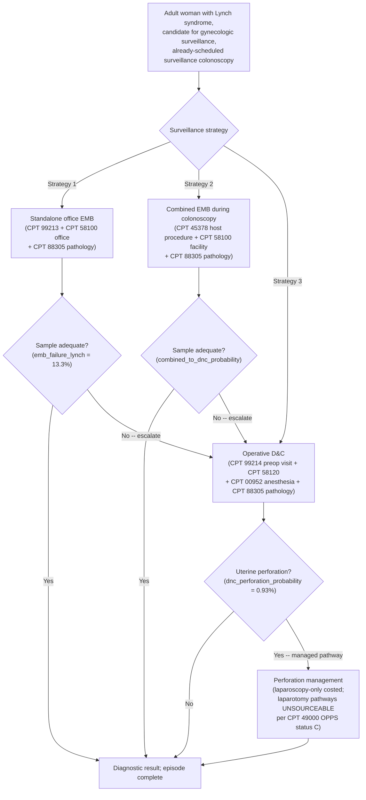
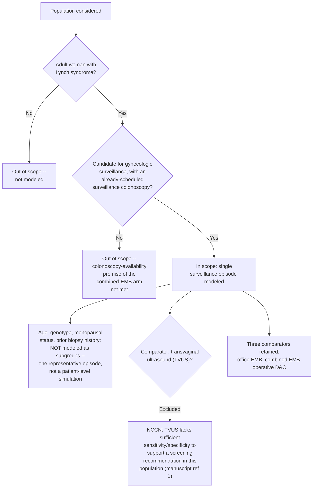
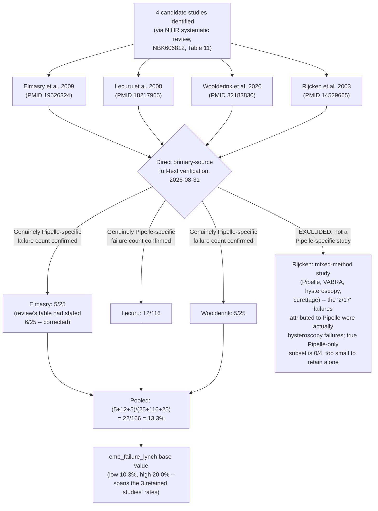
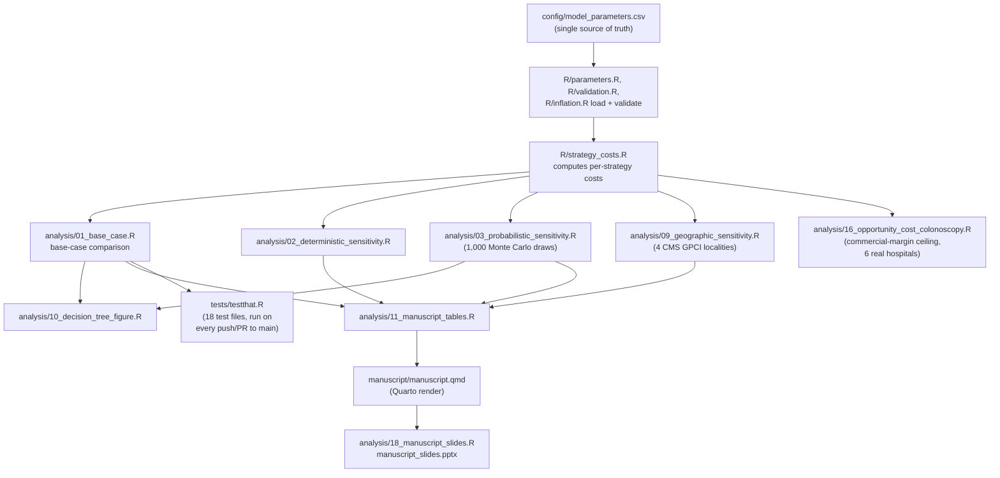
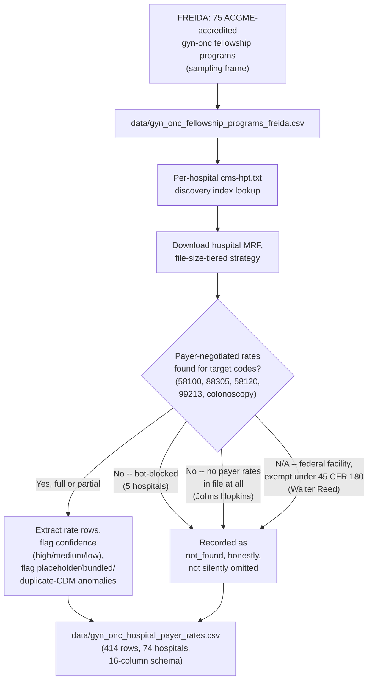

# Clinical coding reference: CPT/HCPCS and ICD-10-CM codes, model structure, and eligibility

This file collects, in one place, every procedure code this model actually prices, the
diagnosis codes that would accompany those procedures in real-world billing, and five
Mermaid diagrams of the model's structure, population eligibility, evidence-selection
process, and data pipelines. It is a reference and orientation document, not a new data
source: every code and dollar figure below is copied from (and must stay consistent
with) `config/model_parameters.csv`, `docs/data_sources.md`, and `manuscript/manuscript.qmd`.
If those files change, this one is stale until re-synced.

No ICD-10-CM code previously existed anywhere in this repository. The codes in the table
below were looked up directly against ICD-10-CM code descriptions (icd10data.com, AAPC)
on 2026-10-02 rather than recalled from memory, consistent with this repository's standing
rule against unverified clinical facts -- see `docs/testing_philosophy.md`. None of the
ICD-10 codes change any model parameter; they are provided for coding/billing orientation
only, the same "does not feed the base-case cost engine" caveat already used for the
hospital payer-rate sample (`docs/data_sources.md`).

## 1. CPT/HCPCS codes used by this model

Every row below is wired into `config/model_parameters.csv`; the "Used in base case?"
column distinguishes parameters that flow into `compute_*_strategy_cost()` from
`reference_only`/`future_extension` parameters kept for context or a later extension.

| CPT/HCPCS | Description | Parameter(s) | CMS-allowed amount | Used in base case? |
|---|---|---|---|---|
| **58100** | Endometrial biopsy, with or without endocervical biopsy, without cervical dilation | `emb_office_professional_cost` (nonfacility/office); `emb_office_professional_cost_facility` (facility/endoscopy-suite) | $97.03 (office); $60.05 (facility) | Yes -- standalone office EMB and the EMB component of combined EMB |
| **88305** | Surgical pathology, gross and microscopic examination, level IV | `emb_pathology_cost` | $50.75 | Yes -- shared across all three strategies (every biopsy specimen is read) |
| **99213** | Office or other outpatient visit, established patient, level 3 | `office_visit_em_cost` | $88.76 | Yes -- standalone office EMB arm only (the visit that generates the biopsy) |
| **99214** | Office or other outpatient visit, established patient, level 4 | `dnc_preop_clinic_visit_cost` | $125.40 | Yes -- D&C arm's preoperative clinic visit (deliberately a *higher* E/M level than the office-EMB visit, reflecting a surgical-planning encounter) |
| **58120** | Dilation and curettage, diagnostic and/or therapeutic (nonobstetric) | `dnc_professional_cost` (and `dnc_anesthesia_cost` via the CPT 00952 ASA crosswalk, below) | see `config/model_parameters.csv` | Yes -- the D&C arm's index procedure |
| **00952** | Anesthesia for dilation and curettage (ASA crosswalk for CPT 58120) | `dnc_anesthesia_cost` | see `config/model_parameters.csv` | Yes -- D&C arm's anesthesia cost |
| **45378** | Colonoscopy, flexible, diagnostic | combined-EMB arm's host procedure (the "already-scheduled surveillance colonoscopy" the biopsy rides along with) | -- | Yes -- defines the combined-EMB arm's clinical premise |
| **G0105** | Colorectal cancer screening; colonoscopy on individual at high risk | one of the three base/screening codes (`45378`, `G0105`, `G0121`) used in `docs/evidence_layers.md`'s national colonoscopy-setting/place-of-service analysis | -- | Context for the colonoscopy-setting evidence layer, not a priced base-case parameter |
| **G0121** | Colorectal cancer screening; colonoscopy on individual not meeting high-risk criteria | same colonoscopy-setting evidence layer, as the average-risk comparator to G0105 | -- | Context only, same as G0105 |
| **49320** | Laparoscopy, surgical; diagnostic (separate procedure), without further intervention | `dnc_perforation_laparoscopy_professional_cost` | see `config/model_parameters.csv` | Yes (partial) -- the only fully professional-plus-facility-costed branch of D&C uterine-perforation management, 21.15% of perforations |
| **49000** | Exploratory laparotomy, separate procedure | referenced in `dnc_perforation_probability`/`dnc_perforation_management_laparoscopy_only_fraction` notes as the immediate-laparotomy and laparoscopy-converted-to-laparotomy perforation-management pathways (28.9% of perforations combined) | **UNSOURCEABLE** -- CPT 49000 carries OPPS status indicator C (inpatient-only), so no OPPS/ASC facility rate exists | No -- deliberately excluded from `adverse_event_cost_partial_perforation_only`; see `docs/ae_cost_evidence_table.md` |
| **58555** | Hysteroscopy, diagnostic (separate procedure) | `cost_hysteroscopy_office_moawad_2014` | $1,356 (procedure charge, not CMS-allowed; Moawad 2014) | No -- `reference_only`, non-Lynch external benchmark |
| **58558** | Hysteroscopy, surgical; with D&C | `hysteroscopy_dc_professional_cost` (`dnc_alt_scenario`, $796.75 facility professional fee); `cost_hysteroscopy_office_munro_2022`, `cost_hysteroscopy_asc_munro_2022`, `cost_hysteroscopy_or_munro_2022`, `cost_hysteroscopy_or_opps_2026` | $796.75 (facility professional fee, live CMS PUF query); see `docs/data_sources.md`'s resolved CPT 58558 data-quality note (2026-08-29) | No -- scenario/reference parameters for a future hysteroscopy-guided-D&C comparator, not wired into any strategy cost function |

**A note on facility vs. nonfacility.** CPT 58100 is the clearest example of this
model's facility/nonfacility discipline: the *same* CPT code pays a different CMS-allowed
amount depending on where it's performed (physician office vs. hospital outpatient/ASC),
because the nonfacility rate folds in practice-expense overhead that the facility rate
does not. `emb_office_professional_cost` and `emb_office_professional_cost_facility` are
two separate, independently sourced parameters for exactly this reason -- never average
them together or substitute one for the other. The same split methodology recurs for CPT
58558 (`hysteroscopy_dc_professional_cost` is facility-setting only) and is why
`dnc_preop_clinic_visit_cost` and `office_visit_em_cost` are priced as different E/M
levels (99214 vs. 99213) rather than treated as interchangeable office visits.

## 2. ICD-10-CM codes relevant to this model's clinical population

Looked up directly against ICD-10-CM FY2026 code descriptions on 2026-10-02 (sources:
icd10data.com, AAPC Codify). These are provided for orientation -- the diagnosis codes a
clinician or biller would attach to the encounters this model prices -- and are not used
anywhere in `config/model_parameters.csv` or any cost function.

| ICD-10-CM | Description | Relevance to this model |
|---|---|---|
| **Z15.04** | Genetic susceptibility to malignant neoplasm of endometrium | The single most specific code for this model's actual population: a woman with Lynch syndrome undergoing endometrial surveillance because of elevated genetic risk, with no active malignancy. More specific than the general Z15.09 catch-all and the code most directly matched to this study's population. |
| **Z15.06** | Genetic susceptibility to malignant neoplasm of digestive system | Lynch syndrome also confers colorectal cancer risk, which is the reason the combined-EMB arm rides along with an already-scheduled surveillance colonoscopy. Relevant to the colonoscopy half of that encounter. |
| **Z15.09** | Genetic susceptibility to other malignant neoplasm | The general code historically used for Lynch syndrome / HNPCC risk before site-specific Z15.0x codes existed; still commonly seen in older records and some payer policies. |
| **C54.1** | Malignant neoplasm of endometrium | Applies only if a biopsy (any of the three strategies' index procedure) returns a cancer diagnosis -- i.e., the "failure" or "positive finding" tail of the model's diagnostic-yield extension, not the surveillance encounter itself. |
| **Z80.0** | Family history of malignant neoplasm of digestive organs | Family-history context commonly documented alongside a Lynch syndrome diagnosis, given the syndrome's autosomal-dominant colorectal cancer risk. |
| **Z80.49** | Family history of malignant neoplasm of other genital organs | The corresponding family-history code for the gynecologic side of Lynch syndrome risk. |
| **Z12.79** | Encounter for screening for malignant neoplasm of other genitourinary organs | Sometimes used as the screening-encounter code for endometrial surveillance in the absence of an endometrium-specific Z12 code; flagged here because at least one payer medical-policy bulletin found during this lookup treats Z12.79 as non-covered for this indication while treating Z15.04 as the appropriate primary diagnosis -- a real coding/coverage nuance, included rather than smoothed over, consistent with this repository's practice of reporting data-quality caveats honestly (see `docs/data_sources.md`). |

**Why no PRISMA-style patient-flow diagram.** `manuscript/manuscript.qmd` states explicitly
that this requirement does not apply: "this is a decision-analytic model, not an
observational or randomized clinical study." There is no accrued patient cohort to trace
through enrollment, exclusion, and follow-up. The two inclusion/exclusion diagrams below
(Sections 3.2 and 3.3) represent the two things this model *does* have an inclusion/exclusion
logic for instead: who the model's population represents, and how specific pooled literature
estimates were screened in or out.

## 3. Five Mermaid diagrams

### 3.1 Decision-tree / model structure

The three strategies this model compares, mirroring `R/strategy_costs.R` and the
decision-tree figure already built from live model output (`analysis/10_decision_tree_figure.R`,
rendered in the README as Figure 2).

### 3.2 Model population eligibility (inclusion/exclusion)

Not a patient-accrual diagram -- there is no enrolled cohort to trace. This represents the
single eligibility definition stated in the manuscript's Methods section
(`manuscript/manuscript.qmd`, lines 189-198) that the whole model stands in for.

### 3.3 Literature inclusion/exclusion for a pooled evidence parameter

A real worked example, not a hypothetical: the full inclusion/exclusion history of
`emb_failure_lynch` (probability of a failed/inadequate office endometrial biopsy in
Lynch surveillance), the model's most heavily re-verified single parameter
(`docs/data_sources.md`, "Full primary-source verification of `emb_failure_lynch`'s four
candidate studies," 2026-08-31).

### 3.4 Repository analysis-script data-flow pipeline

The real execution order of `analysis/`'s eighteen numbered scripts, grouped by what each
stage produces, matching `README.md`'s "Repository structure" section.

### 3.5 Hospital MRF data-collection pipeline

The 74-hospital gyn-onc fellowship payer-rate sample built this project cycle
(`data/gyn_onc_hospital_payer_rates.csv`, see `docs/data_sources.md`), shown as a pipeline
rather than an inclusion/exclusion diagram because its "exclusions" are data-availability
outcomes (bot-blocked, no rates published), not eligibility criteria.

## 4. Fine details

- **No ICD-10 code appears in `config/model_parameters.csv` or any R/analysis script.**
  Diagnosis codes are a billing-documentation concern; this model prices CMS-allowed
  *procedure* amounts (CPT/HCPCS), which is why Section 2's table exists purely as
  orientation and carries no `used_in_model` column.
- **CPT 49000 and the laparotomy perforation-management pathways are the one place in
  this model where a real cost is known to exist but cannot be sourced from public CMS
  data** (OPPS status indicator C, inpatient-only, no ASC/OPPS facility rate). The model
  reports its perforation-management cost as an explicit partial/lower-bound figure rather
  than estimating or omitting the gap silently -- see `docs/ae_cost_evidence_table.md`.
- **G0105 and G0121 are not Lynch-specific codes.** They appear only in the national
  colonoscopy-setting/place-of-service evidence layer (`docs/evidence_layers.md`) as
  general CMS claims-volume context for where colonoscopies are performed, not as priced
  parameters for this model's combined-EMB arm (which uses CPT 45378).
  `summarize_base_code_place()` restricts its place-of-service check to exactly these
  three base/screening codes (45378, G0105, G0121) using CMS's `Tot_Bene_Day_Srvcs` field
  specifically because a single colonoscopy encounter can generate multiple same-day
  service-line codes, which would otherwise overstate encounter counts.
  `docs/evidence_layers.md` has the exact context.
- **The facility/nonfacility CPT 58100 split is not a rounding convenience** -- the two
  parameters differ by $36.98 (office $97.03 vs. facility $60.05) because the office rate
  bundles practice-expense overhead that the facility setting bills separately. Any future
  change that collapses these into one "EMB professional fee" parameter would be a real
  methodological regression, not a simplification.
- **CPT 58558's professional-fee figure was the subject of a resolved data-quality flag**
  (2026-08-29, per `docs/data_sources.md`): an earlier $204.41 figure and a conflicting
  $1,269.90 citation both turned out to be artifacts of conflating facility and nonfacility
  settings. The current $796.75 facility-setting figure comes from a live CMS Data API
  query (383 provider rows, 6,393 total services), not a static citation -- worth knowing
  before citing this number elsewhere, since it is reproducible but not hand-copied from a
  paper.
